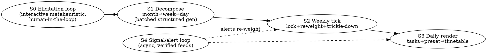
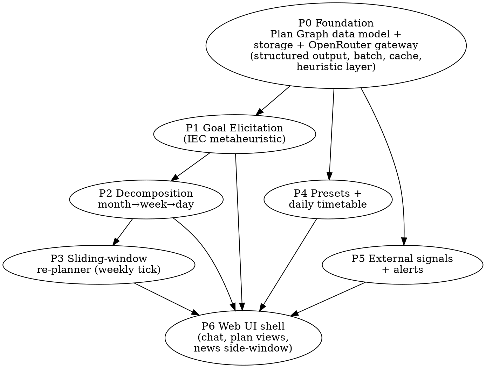

# Canonical Project Graph — Spacato (AI goal-planning app)

> Status: **draft for discussion**, generated during brainstorming on 2026-05-27.
> Everything below is a *proposal to react to*, not a locked decision. Assumptions are marked **[ASSUMPTION]**.

This document holds two intertwined "canonical" representations of the problem, plus the decomposition into buildable sub-projects.

---

## 1. Domain representation — the **Plan Graph**

The single data structure the whole app revolves around: a **multi-resolution, weighted, temporal goal-decomposition forest** overlaid on a shared calendar, where **days are the integration layer** ("blends tasks and goals into 1 day") and a **sliding window** controls which layers are mutable.

### Node types

| Node | Key fields | Notes |
|------|-----------|-------|
| **Goal** (root) | `id, title, converged_spec, timeframe, weight, status, fitness_history` | Output of the elicitation metaheuristic. |
| **Monthly** | `goal_id, month_index, objective, weight, progress` | Coarse milestone band. |
| **Weekly** | `month_id, week_index, tasks[], crispness, reweight_log` | The unit that gets locked/reweighted by the sliding window. |
| **Day** | `date, blocks[], source_tasks[], preset_id, status` | Integration layer: many tasks from many goals blend into one timetable. |
| **Preset** | `id, name, blocks_template[], rules` | Daily timetable templates (weekend / birthday / custom). |
| **ExternalSignal** | `source, kind(news/weather/market), payload, linked_goal_ids, fetched_at` | From verified/secure feeds only. |
| **Alert** | `signal_id, goal_id, impact_score, message` | Signal that crosses a goal-impact threshold. |
| **ElicitationState** | `goal_id, generation, population[], pending_questions[]` | Live state of the human-in-the-loop metaheuristic. |

### Resolution gradient (the sliding window)

```
time →   [ now ......... +2 weeks ] [ +2w .. +2 months ] [ further out ........ ]
state     CONCRETE / LOCKED          SOFT / REWEIGHTABLE   COARSE / TRICKLE-DOWN
edits     daily blocks fixed         weekly reweight by    weight nudges only,
          per chat/preset            progress              decaying overhead
```

- **Near (≤2 weeks):** fully concrete day timetables, locked.
- **Mid:** weekly objectives re-weighted by measured progress at each weekly tick.
- **Far:** only weight nudges trickle down; cost of updating decays with distance (cheap, low-overhead).

---

## 2. Process representation — the **agentic pipeline**

A state machine of agents + deterministic heuristics. Stages:



### Heuristic vs LLM split (prompt minimisation by design)

- **Deterministic heuristics:** calendar arithmetic, weight normalisation, decay schedules, packing tasks into day blocks, dedup / uniqueness checks, threshold tests for alerts.
- **LLM (batched + cached, via OpenRouter):** semantic goal interpretation, mutation/crossover operators, decomposition prose, relevance judgement of signals.

### The elicitation metaheuristic (S0) — concrete shape

This is **Interactive Evolutionary Computation (IEC)** + **active preference elicitation**, with the LLM acting as the genetic operator:

- **Genome** = structured goal interpretation across dimensions (scope, success-metric, constraints, motivation, deadline-shape, …).
- **Population** = K candidate interpretations, seeded from the user's free text.
- **Fitness** = elicited from the user via *few, high-information* questions (active learning → minimise queries).
- **Operators** = LLM-driven crossover (blend two interpretations) + mutation (perturb the most-uncertain dimension first → "indirect heuristic" for max info gain).
- **Convergence** = candidate variance < threshold, or explicit user confirm.
- **SOTA anchors to deep-research:** Interactive Genetic Algorithms, Bayesian/active preference elicitation, LLM-as-evolutionary-operator (e.g. EvoPrompt-style language-model crossover). *[targeted research deferred to the chosen first slice]*

---

## 3. Decomposition into sub-projects (build order)

Each is its own spec → plan → implementation cycle. Edges = "depends on".



**Recommended first spec:** **P0 + a thin vertical slice of P1** — a runnable "goal discussion → stored converged spec" loop, end to end. The user emphasised goal discussion is the first experience, and a vertical slice de-risks the Plan Graph data model before we build decomposition on top of it.

---

## 4b. Candidate shared abstraction — **Evolutionary Search Core (ESC)** *(under discussion)*

Raised 2026-05-27: the elicitation metaheuristic and the news/relevance system may share one engine.

```
Evolutionary Search Core (ESC)   ← would live in P0 Foundation
  Genome (typed), seed(ctx)->population, crossover(a,b)/mutate(g) [LLM-backed],
  fitness(g)->score [pluggable], select/converge, query-budget/batch control

  ├─ S0  Goal elicitation : genome = goal interpretation;
  │                         fitness = explicit user answers (few, high-info);
  │                         lifecycle = CONVERGE ONCE (interactive/batch).
  └─ P5  Relevance search : genome = query/source-filter set per goal;
                            fitness = LLM-relevance × implicit user engagement;
                            lifecycle = ONLINE/continuous (target drifts, never done).
```

**Scope precisely:** ESC reuse covers **adaptive query/source selection** only. **Per-item relevance
scoring** stays a plain heuristic (embedding similarity + LLM judge), not evolution.

**Implication:** if adopted, ESC moves into **P0 Foundation** as a core primitive (not private to P1),
and the core must support an *online* lifecycle, not just converge-once. **Decision pending.**

### DECISION (2026-05-27): build both in full

ESC adopted as a shared, **online-capable** P0 primitive. Both consumers (S0 elicitation, P5 news)
built in full. Build sequencing (ESC is shared state → not independent):

```
Phase A (sequential, 1 agent) : build ESC core (online-capable interface + impl)
Phase B (parallel, 2 agents)  : Agent-S0 elicitation  ‖  Agent-P5 news/relevance
```

### Canonical role prompt (for all design/build agents)

> You are a senior systems designer who worked at Google's UK campus (King's Cross, London) during
> 2021–2022, specialising in agentic/LLM planning systems. You design for **isolation and clarity**:
> small units, well-defined interfaces, each independently testable. You are **heuristics-first** —
> deterministic logic does the calendar math, weighting, decay, packing, and dedup; the LLM is invoked
> only where it earns its place, always **batched and cached**. You ship **real, concrete, tested**
> work — never placeholders, never stubs left behind. You state assumptions explicitly and verify
> before claiming done.

## 4. Foundational decisions — RESOLVED (2026-05-27)

1. **Audience & deployment:** single-user, **local only**. OpenRouter key in a local env file, proxied
   through a Next.js API route so it never enters the browser bundle. No auth.
2. **Tech stack:** **Next.js (TypeScript) full-stack**. Local persistence via **SQLite**.
3. **v1 scope:** build P0 + S0 + P5 in full (per "build both in full" decision), ESC online-capable.

## 5. SOTA research findings (2026-05-27) — grounding the first slice

- **ESC operator layer ← EvoPrompt (ICLR 2024).** Population + LLM-as-crossover/mutation + EA-driven
  selection is a proven, canonical pattern. ESC adopts it. (arXiv:2309.08532; EC+LLM survey 2505.15741)
- **S0 question selection ← Bayesian active preference elicitation.** Choose each query by
  information-gain / expected-regret minimisation; prefer **pairwise comparisons** ("more like A or B?").
  Hits the "few, high-information questions" requirement better than naive variance-questioning.
  (BOPE 2203.11382; setwise minimax-regret hal-03142685; entropy pursuit 1702.07694;
  Deep Bayesian Active Learning for LLM preference modelling, NeurIPS 2024)
- **P2/P3 decomposition & sliding window ← 2025 anchors (deferred).** GoalAct (continuously-updated
  global plan + hierarchical execution) ≈ our weekly-tick re-planner; HiPlan (milestone guide + stepwise
  hints) and ReAcTree (recursive subgoal tree) anchor decomposition.

### Refined first-slice design (ESC core + S0 elicitation)

```
ESC core (P0, online-capable)
  Genome<T>            typed candidate
  seed(ctx) -> Pop     LLM seeds K candidates from free text
  crossover(a,b)/mutate(g)   LLM-backed operators (EvoPrompt pattern), BATCHED
  fitness(g) -> score  pluggable
  select / step        EA loop; converge-once OR online (lifecycle wrapper)

S0 elicitation (consumer of ESC)
  Genome = goal interpretation (dims: scope, success-metric, constraints, motivation, deadline-shape)
  fitness source = ACTIVE ELICITATION: pick next pairwise comparison by max info-gain;
                   user answers update belief; surface ≤1-2 questions per generation
  converge -> converged_spec  (stored on Goal node)
```

### DECISION (2026-05-27): full Bayesian elicitation, no shortcuts

S0 uses a **full Bayesian active-elicitation** loop, built **componentwise in parallel** (subagents):

- **Belief model** — posterior weights over the candidate population (particle representation of the
  LLM-generated genomes); update via a **Bradley–Terry / logistic** preference likelihood from each
  pairwise answer.
- **Acquisition** — choose the next pairwise comparison by **expected information gain (mutual info)**,
  cross-checked against **setwise minimax regret**; surface ≤1–2 questions per generation.
- **Operators** — shared ESC `seed/crossover/mutate` (LLM-backed, EvoPrompt pattern).
- **Convergence** — posterior entropy below threshold, or explicit user confirm.

**First spec covers:** `llm-gateway` + `esc-core` + `plan-store` (Phase A, sequential) →
`s0-elicitation` + `p5-signals` (Phase B, parallel role-primed agents). Decomposition / sliding-window /
presets / UI-shell are later specs.
